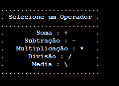

  

<h1 align="center">Portugol Projects</h1>

Auto Taught Activities I made

Activites
=================
<!--ts-->
   * [Calculator](#calculator)
<!--te-->
## Calculator
**Challenge:**
* Read two inputs 
* Show the Table of Operations
* Read the Operation
* Show the Results of the Operation

### Project structure

>

